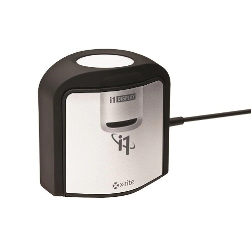

# LG calib

Color calibration guide for LG OLED TV

I'm writing this guide as a reference for color calibrating modern LG OLED TVs.

I'm using a G2 with the 04.x firmware. Feel free to open a Pull Request (or just click Edit here in GitHub) to add things related to different models.

For calibrating I'm using a X-Rite i1 Display Pro series (i1D3) colorimeter. It has many different names, if it looks like this, it should work.

Parts

1. [First setup](1_first_setup.md)

2. [bscpy setup](2_bscpy.md)

3. [SDR calibration](3_sdr.md)
